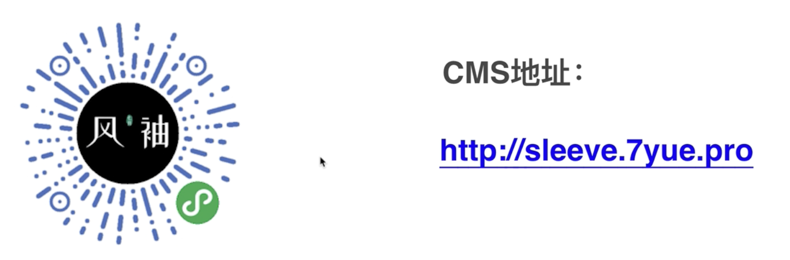

## 风袖小程序
- 用一个完整的高级电商学习主流的WEB技术
1. 
2. CMS地址:
    - http://sleeve.7yue.pro
    - http://sleeve.talelin.com/#/about
3. 课程服务
    - http://talelin.com

## 学习计划
1. 小程序前端
    - JS,CSS,小程序基础,自定义组件,ES6,Promise
    - 全面使用async await
        - 甚至要把不支持的也改成支持的
2. C端API
    - 应当与CMS API分开
    1. Java & Java SpringBoot
        - 注解,接口,类,IOC
        - JDBC MYBAITS
3. CMS前端
    - VUE 3.0
    1. VUE JavaSpringBoot
4. CMS API
    - 如果要合并开发,应该把CMS API作为基础进行开发

## 软件下载
1. 微信开发
     - uname -a ,查看mac版本
     - ARM64
2. 开发者key
    - bGBlvEJUK04ptYVr
